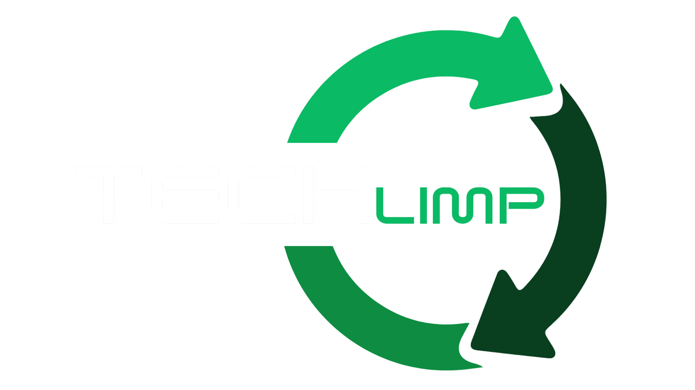

<p align="center">
  
</p>

> Aplicativo mobile para descarte consciente de resíduos eletrônicos — conectando pessoas a pontos de coleta próximos e promovendo sustentabilidade.

---

##  Sobre o Projeto

O **TechLimp** é um aplicativo mobile desenvolvido como Trabalho de Conclusão de Curso (TCC) do curso Técnico em Desenvolvimento de Sistemas da **ETEC Juscelino Kubitschek de Oliveira**.

O projeto nasceu da necessidade de facilitar o descarte correto de lixo eletrônico (e-lixo), um problema ambiental crescente no Brasil e no mundo. Por meio do app, o usuário consegue localizar pontos de coleta próximos à sua localização, contribuindo para a sustentabilidade e o reaproveitamento de recursos eletrônicos.

---

##  Objetivo

Auxiliar a população no descarte responsável de resíduos eletrônicos, prezando pela:

- ♻️ Sustentabilidade ambiental
- 🔋 Reutilização de componentes e recursos
- 🌍 Saúde do meio ambiente

---

##  Funcionalidades

- 📍 Mapa interativo com pontos de coleta de e-lixo próximos ao usuário
- 🔎 Busca e filtragem de pontos por localização
- 📋 Informações detalhadas sobre cada ponto de coleta
- 🗺️ Integração com Google Maps para navegação até o local

---

##  Tecnologias Utilizadas

| Camada | Tecnologia |
|--------|------------|
| Mobile (Front-end) | React Native |
| Linguagem | TypeScript |
| Back-end | PHP |
| Banco de Dados | MySQL |
| Mapas | Google Maps API |
| Ambiente | Expo, npm |
| Versionamento | Git / GitHub |

---

##  Estrutura do Projeto

```
Projeto_TechLimp/
├── src/
│   ├── components/     # Componentes reutilizáveis
│   ├── screens/        # Telas do aplicativo
│   ├── services/       # Integração com APIs
│   └── database/       # Configurações do banco de dados
├── backend/            # Servidor PHP
├── assets/             # Imagens e recursos estáticos
├── App.tsx             # Ponto de entrada do aplicativo
└── package.json
```

>  A estrutura acima é ilustrativa. Consulte os arquivos do repositório para a estrutura real.

---

## ⚙️ Como Rodar o Projeto

### Pré-requisitos

- [Node.js](https://nodejs.org/) instalado
- [Expo CLI](https://expo.dev/) instalado (`npm install -g expo-cli`)
- [PHP](https://www.php.net/) instalado
- Banco de dados MySQL configurado
- Chave de API do [Google Maps](https://developers.google.com/maps)

### Instalação

```bash
# Clone o repositório
git clone https://github.com/ThigasTT/Projeto_TechLimp.git

# Entre na pasta do projeto
cd Projeto_TechLimp

# Instale as dependências
npm install

# Inicie o aplicativo com Expo
npx expo start
```

### Back-end

Configure as variáveis de ambiente com as credenciais do seu banco de dados MySQL e suba o servidor PHP localmente.

---

##  Equipe

Projeto desenvolvido em equipe como TCC do curso Técnico em Desenvolvimento de Sistemas.

| Desenvolvedor | GitHub |
|---------------|--------|
| Lucas Brito | [@LucasBribs](https://github.com/LucasBribs) |
| Thiago Caetano (ThigasTT) | [@ThigasTT](https://github.com/ThigasTT) |
| Henrique Veiga (HenriqueVeigaa) | [@HenriqueVeigaa](https://github.com/HenriqueVeigaa) |
| Jeferson Brandão (JefersonBran) | [@JefersonBran](https://github.com/JefesonBran) |
| Arthur Ferraz (ArthurFMe) | [@ArthurFMe](https://github.com/ArthurFMe) |


---

##  Licença

Este projeto foi desenvolvido para fins educacionais como parte do TCC da ETEC JK. Sinta-se à vontade para utilizá-lo como referência.

---

##  Impacto Social

O descarte inadequado de resíduos eletrônicos é responsável por sérios danos ao meio ambiente, contaminando solo e água com metais pesados como chumbo e mercúrio. O TechLimp busca ser uma ferramenta acessível para que qualquer pessoa possa fazer sua parte de forma simples e prática.

---

<p align="center">Desenvolvido com 💚 pelo grupo TechLimp | ETEC JK — 2025</p>
